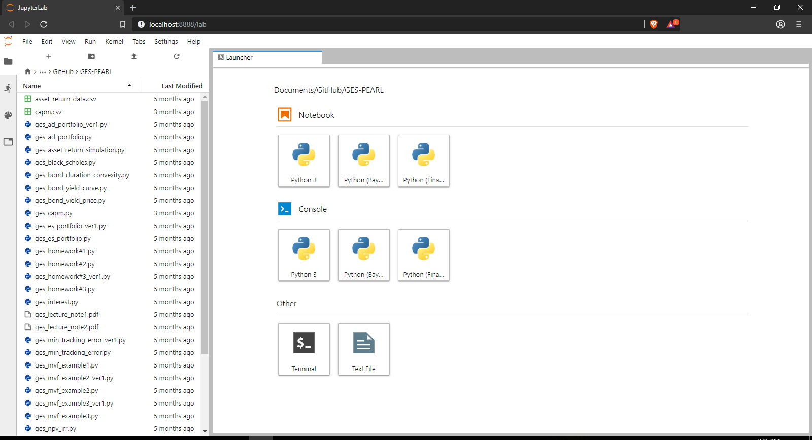

# GES-PEARL

## Course materials for GENERAL EDUCATION SEMINAR (PEARL)

Teruo Nakatsuma (Faculty of Economics, Keio University, Japan)

---

## How to set up Python and necessary packages

I strongly recommend using [Anaconda](https://www.anaconda.com/). It can install Python along with numerous essential packages at once and allows us to manage those packages flexibly.

### Step 1: Installing Anaconda

1. If you have an older Anaconda on your PC, uninstall it completely by folloiwng [instructions](https://docs.anaconda.com/anaconda/install/uninstall/).

2. Download an Anaconda installer (Windows, macOS or Linux) from [here](https://www.anaconda.com/distribution/). Choose a Python 3 installer.

3. Doubleclick the installer and keep clicking `Continue`, `Next` or `Ok`.

### Step 2: Creating an environment

Start `Anaconda Powershell Prompt` (Windows) or `Terminal` (macOS, Linux) and type

#### Windows

```IPython
(base) C:\Users\Thomas> conda create -n finance python=3.6 jupyterlab seaborn spyder cvxgrp::cvxpy
```

#### macOS and Linux

```IPython
(base) Bayes:~ Thomas$ conda create -n finance jupyterlab seaborn spyder conda-forge::cvxpy
```

Then type

```IPython
(base) C:\Users\Thomas> conda activate finance
```

You will notice that the prompt is altered as

```IPython
(finance) C:\Users\Thomas>
```

Finally type

```IPython
(finance) C:\Users\Thomas> python -m ipykernel install --user --name finance --display-name "Python (Finance)"
```

Now you are ready for Python!

**WARNING: The version of CVXPY installed with the above setup is 0.4 for Windows while it is 1.0 for macOS and Linux.**

---

## How to start JupyterLab

Start `Anaconda Navigator`. You may find it in `Start Menu` (Windows) or `Launchpad` (macOS). Alternatively you just type

```IPython
(base) C:\Users\Thomas> anaconda-navigator
```

in `Anaconda Powershell Prompt` (Windows) or `Terminal` (macOS, Linux).

Click the `Launch` button in the `JupyterLab` panel.


Your default browser will pop up. Click the `Python (Finance)` button to create a Jupyter notebook.



---

## Python codes and related files

| file name | description |
|:-------------------------------|:------------------------------------------|
| asset_return_data.csv          | simulated asset returns                   |
| capm.csv                       | market capitalization data                |
| ges_ad_portfolio_ver1.py       | mean absolute deviation portfolio         |
| ges_ad_portfolio.py            | compatible with old CVXPY                 |
| ges_asset_return_simulation.py | simulation of asset returns               |
| ges_black_scholes.py           | Black-Scholes formula for option pricing  |
| ges_bond_duration_convexity.py | duration and convexity of bond            |
| ges_bond_yield_curve.py        | yield curve of bond                       |
| ges_bond_yield_price.py        | price-yield relationship                  |
| ges_capm.py                    | CAPM beta estimation                      |
| ges_es_portfolio_ver1.py       | expected shortfall portfolio              |
| ges_es_portfolio.py            | compatible with old CVXPY                 |
| ges_interest.py                | interest rate                             |
| ges_min_tracking_error_ver1.py | tracking-error minimization               |
| ges_min_tracking_error.py      | compatible with old CVXPY                 |
| ges_mvf_example1.py            | mean-variance portfolio                   |
| ges_mvf_example2_ver1.py       | mean-variance portfolio w/o short selling |
| ges_mvf_example2.py            | compatible with old CVXPY                 |
| ges_mvf_example3_ver1.py       | mean-variance portfolio with data         |
| ges_mvf_example3.py            | compatible with old CVXPY                 |
| ges_npv_irr.py                 | present value, internal rate of return    |
| ges_option_pricing.py          | option pricing with binomial tree model   |
| ges_risk_parity.py             | risk parity portfolio                     |
| ges_sv_portfolio_ver1.py       | semivariance portfolio                    |
| ges_sv_portfolio.py            | compatible with old CVXPY                 |
